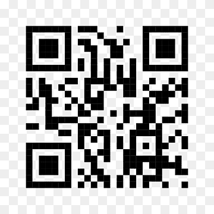

# 1- Headings 
How to give headings in markdown file 

# Heading-1
## Heading-2
### Heading-3
####  Heading-4


# 2-Block of code
This is the normal test in markdown
>This is the special text in markdown

>This is the 2nd special text in markdown\

this is the python course of 40 days with ammar bhi named as\
**python ka chila**

# 3-Combine Two things
Block of words and headings
># heading 2


# 4- Face of text 
>**Bold**\
>*Italic*\
>***Bold and Italic***


# 5- With other symbols
we are also using other symbols("_"):
>__Bold__\
>_Italic_\
>___Bold and Italic___


# 6- Bullet points/ list
- Day1 
- Day2
- Day3
   - day3a 
      - subheadings
   - day3b
     - subheadings

> List in numbering

1.  Day1 
2.  Day2
3.  Day3
   
> __we can also use the * or + for this purpose of creating the list__

* Day1
* Day2
+ day1
+ day2


#  7- Line Breaks or page breaks 
this is the first page.
___
---
***
this is the  second page.


# 8- Links and HyperLinks 
<http://www.google.com>\
[python](https://www.python.org/)

[google]:http://www.google.com
this is link of google is [here][google]

# 9- Images and figures With links
This how we paste the QR code in markdown\
This is the QR code of the GOOGLE

> How to comment Out a markdown line.

[This is the comment in markdown]:#

<!--This is also a comment-->

Now we are continous working with the markdown language after a comment line .

Online Image Link:


# 10- Adding code and Block of code  in markdown

To Print some this in python we use:\
 `print("Khizer Rehman")`


```python
import pandas as pd
```
>This code show the different color.

```python
x = 8*0
y = 9+0
z = 9/2
print(x)
print(y)
print(z)
```
# 11- Adding the Table in markdown

|Name |Class |Marks|
|:-----:|:------:|:-----:|
|Khizer|BSSE|3.36|
|Adan|BSSE|3.56|
|Ahtesham|BSSE|3.346|
|Danish|BSSE|3.59|

>This is who we create tables in markdown

# 12- Table Contents
[1- Heading](#1--headings)\
[2- Block of code](#2-block-of-code)\
[3- Combine Two things](#3-combine-two-things)\
[4- Face of Text](#4--face-of-text)\
[5- With other symbols](#5--with-other-symbols)\
[6- Bullet Point List](#6--bullet-points-list)\
[7- Line breaks or page breaks](#7--line-breaks-or-page-breaks)\
[8- Link and HyperLinks](#8--links-and-hyperlinks)\
[9- Images and Figures with Links](#9--images-and-figures-with-links)\
[10- Adding code and Block of code in markdown](#10--adding-code-and-block-of-code--in-markdown)
[11- Adding table in Markdown](#11--adding-the-table-in-markdown)\
[12- Table of content](#12--table-contents)\
[13- Install the Extentions](#13--install-the-extentions)


# 13- Install the Extentions 

**Simple text**

**Bold**

_Italic_

***Bold and Italic***

[Google Hyperlink](http://www.google.com)


Column A | Column B | Column C
---------|----------|---------
 A1 | B1 | C1
 A2 | B2 | C2
 A3 | B3 | C3


Column A | Column B | Column C
---------|----------|---------
 A1 | B1 | C1
 A2 | B2 | C2
 A3 | B3 | C3

```
 x = y = z
```
